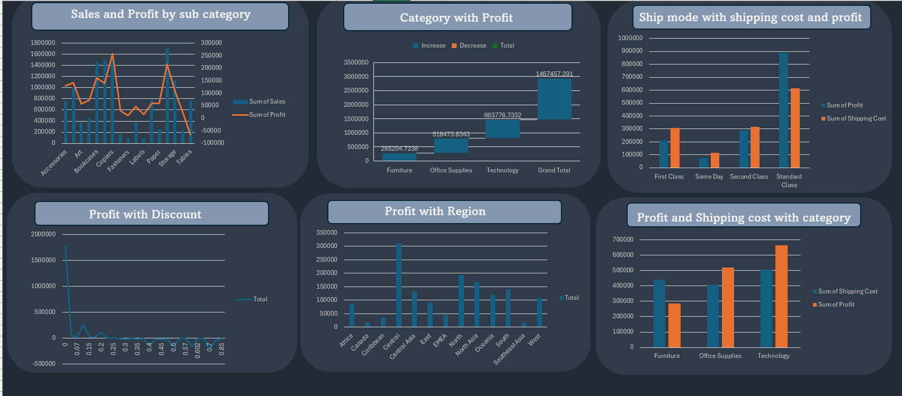
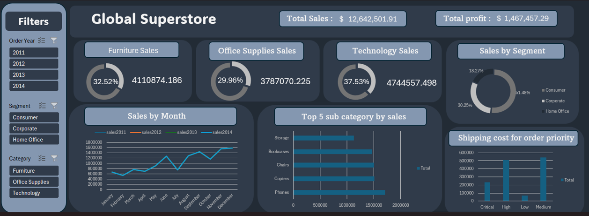

# 🛒 Global Superstore Sales Dashboard (Excel)

## 📌 Project Overview
This project involves analyzing a comprehensive sales dataset for a Global Superstore. The goal was to transform raw sales records into an interactive Excel Dashboard that helps stakeholders track **Total Sales**, **Profit**, and **Shipping Costs** across different regions and segments.

## 📊 Dashboard Preview

## 🛠 Tools & Techniques Used
- **Microsoft Excel:** The core tool for this project.
- **Pivot Tables:** Used extensively to summarize data for KPIs, Monthly Sales, and Category breakdowns.
- **Slicers:** Added interactive filters for **Order Year**, **Segment**, and **Category** to make the dashboard dynamic.
- **Data Visualization:**
  - **Donut Charts:** For Sales by Segment and Category.
  - **Line Chart:** To show Sales Trends over months/years.
  - **Bar Charts:** For Top 5 Sub-categories and Shipping Cost analysis.
- **Data Cleaning:** Processed the raw `Global_Superstore2.csv` file to ensure data quality before analysis.

## 🔍 Key Insights
1.  **Total Performance:** The store generated over **$12.6M in Sales** with a total profit of **$1.4M**.
2.  **Best Sellers:** The **Technology** category leads in sales volume, followed by Furniture.
3.  **Customer Segments:** The **Consumer** segment accounts for the majority of sales (51.48%), significantly outperforming Corporate and Home Office.
4.  **Seasonality:** Sales trends show significant growth towards the end of the year (Q4), indicating strong seasonal demand.
5.  **Top Products:** Items like Phones and Copiers are among the top revenue-generating sub-categories.

## 📂 Project Structure
- **Global_Superstore2.xlsx:** The main Excel file containing the raw data, pivot tables, and the final dashboard.
- **Raw Data (CSV):** Included as `Global_Superstore2.csv` for reference.
- **Helper Sheets:** Separate sheets were used for calculations (KPIs, Monthly trends) to keep the Dashboard view clean.

## 🚀 How to Use
1.  Download the `Global_Superstore2.xlsx` file.
2.  Open it in Microsoft Excel.
3.  Use the **Slicers** on the left panel to filter the data by Year (2011-2014) or Category.
4.  The charts and KPIs will update automatically based on your selection.

---
*Created by [Arwa El-olimy]*
