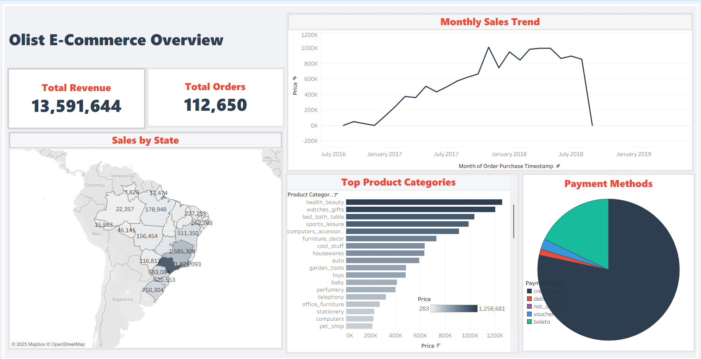

# 📊 Olist E-Commerce Analysis Dashboard

This project is a comprehensive analysis of the Brazilian E-Commerce public dataset by Olist. The dashboard was built using **Tableau** to provide actionable insights into Sales Performance, Logistics Efficiency, and Customer Satisfaction.

## 📂 Project Structure
- **Dashboard File:** `Olist_Project.twbx` (Download and open with Tableau Desktop/Public).
- **Data Source:** 9 CSV tables containing 100k orders from 2016-2018 (Located in the `Data` folder).

## 📸 Dashboard Screenshots

### 1. Sales & Product Performance

*Overview of total revenue, top-selling categories, and monthly sales trends.*

### 2. Logistics & Delivery Operations

*Analysis of delivery times, freight costs, and on-time delivery rates across states.*

### 3. Customer Satisfaction & Reviews

*Insights into customer ratings and the impact of delivery delays on satisfaction.*

## 💡 Key Insights & Features

### 1. Sales & Product Performance 💰
- **Objective:** Analyze revenue trends and top-selling categories.
- **Key Findings:**
  - Total Revenue: **13.5M**.
  - Top Categories: **Bed_Bath_Table** & **Health_Beauty**.
  - **Credit Cards** are the dominant payment method.

### 2. Logistics & Delivery Operations 🚚
- **Objective:** Evaluate shipping efficiency and delivery times.
- **Key Metrics:**
  - Calculated **Actual Delivery Time** vs. Estimated Time.
  - **On-Time Delivery Rate:** ~92%.
  - Correlation between **freight cost** and delivery distance (State-level analysis).

### 3. Customer Satisfaction (Reviews) ⭐
- **Objective:** Understand the impact of logistics on customer ratings.
- **Key Findings:**
  - Average Review Score: **4.1/5**.
  - Strong correlation between **Delayed Orders** and **Low Ratings (1 Star)**.

## 🛠 Tools Used
- **Tableau:** Data Modeling, Visualization, and Dashboarding.
- **Data Modeling:** Star Schema connecting Orders, Items, Products, Customers, and Reviews.
- **Preprocessing:** Translated product names (Portuguese to English) and calculated delivery metrics.

---
*Created by [Arwa Elolimy]*